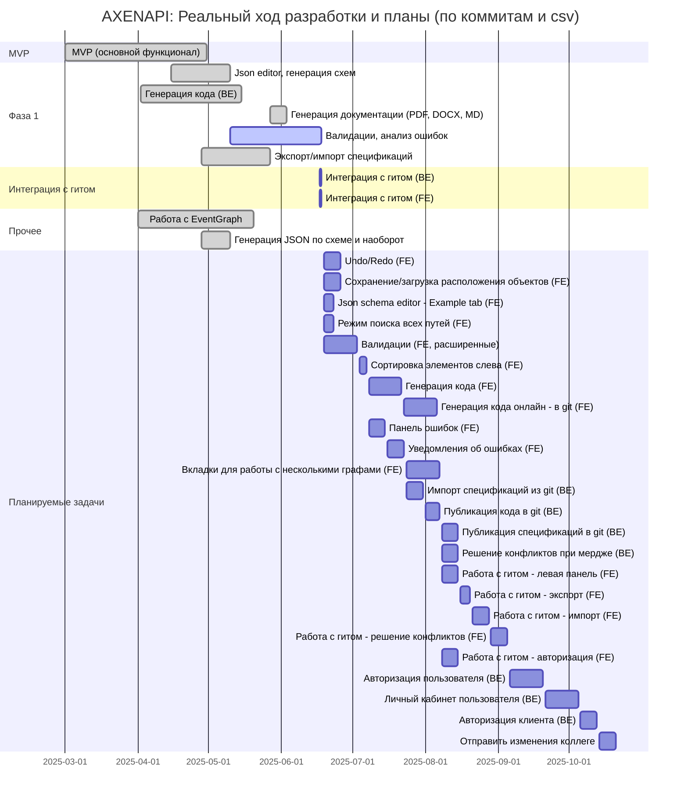

```mermaid
gantt
    title AXENAPI: Реальный ход разработки и планы (по коммитам и csv)
    dateFormat  YYYY-MM-DD

    section MVP
    MVP (основной функционал):done, mvp, 2025-03-01, 2025-04-30

    section Фаза 1
    Json editor, генерация схем:done, json_edit, 2025-04-15, 2025-05-10
    Генерация кода (BE):done, codegen_be, 2025-04-02, 2025-05-15
    Генерация документации (PDF, DOCX, MD):done, doc_gen, 2025-05-27, 2025-06-03
    Валидации, анализ ошибок:active, validate, 2025-05-10, 2025-06-18
    Экспорт/импорт спецификаций:done, spec_export, 2025-04-28, 2025-05-27

    section Интеграция с гитом
    Интеграция с гитом (BE):active, git_be, 2025-06-17, 2025-06-18
    Интеграция с гитом (FE):active, git_fe, 2025-06-17, 2025-06-18

    section Прочее
    Работа с EventGraph:done, eventgraph, 2025-04-01, 2025-05-20
    Генерация JSON по схеме и наоборот:done, json_tools, 2025-04-28, 2025-05-10

    section Планируемые задачи
    Undo/Redo (FE): plan_undo, 2025-06-19, 2025-06-26
    Сохранение/загрузка расположения объектов (FE): plan_save, 2025-06-19, 2025-06-26
    Json schema editor - Example tab (FE): plan_example, 2025-06-19, 2025-06-23
    Режим поиска всех путей (FE): plan_paths, 2025-06-19, 2025-06-23
    Валидации (FE, расширенные): plan_valid, 2025-06-19, 2025-07-03
    Сортировка элементов слева (FE): plan_sort, 2025-07-04, 2025-07-07
    Генерация кода (FE): plan_codegen_fe, 2025-07-08, 2025-07-22
    Генерация кода онлайн - в git (FE): plan_codegen_git, 2025-07-23, 2025-08-06
    Панель ошибок (FE): plan_err_panel, 2025-07-08, 2025-07-15
    Уведомления об ошибках (FE): plan_err_notify, 2025-07-16, 2025-07-23
    Вкладки для работы с несколькими графами (FE): plan_tabs, 2025-07-24, 2025-08-07
    Импорт спецификаций из git (BE): plan_git_import, 2025-07-24, 2025-07-31
    Публикация кода в git (BE): plan_git_pub, 2025-08-01, 2025-08-07
    Публикация спецификаций в git (BE): plan_git_spec, 2025-08-08, 2025-08-15
    Решение конфликтов при мердже (BE): plan_git_merge, 2025-08-08, 2025-08-15
    Работа с гитом - левая панель (FE): plan_git_panel, 2025-08-08, 2025-08-15
    Работа с гитом - экспорт (FE): plan_git_export, 2025-08-16, 2025-08-20
    Работа с гитом - импорт (FE): plan_git_import_fe, 2025-08-21, 2025-08-28
    Работа с гитом - решение конфликтов (FE): plan_git_conflict, 2025-08-29, 2025-09-05
    Работа с гитом - авторизация (FE): plan_git_auth, 2025-08-08, 2025-08-15
    Авторизация пользователя (BE): plan_auth, 2025-09-06, 2025-09-20
    Личный кабинет пользователя (BE): plan_cab, 2025-09-21, 2025-10-05
    Авторизация клиента (BE): plan_client_auth, 2025-10-06, 2025-10-13
    Отправить изменения коллеге: plan_share, 2025-10-14, 2025-10-21
``` 